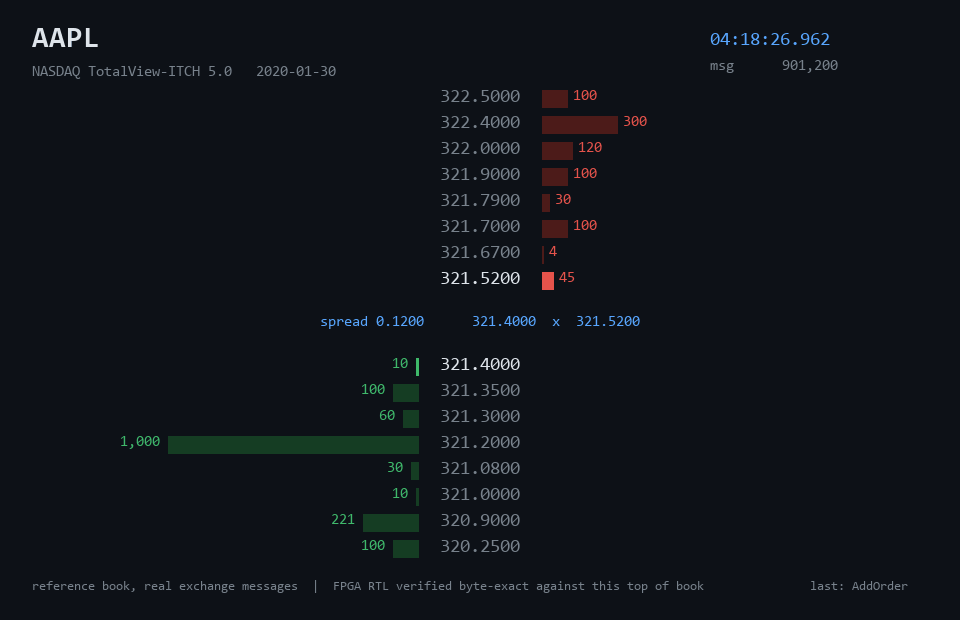
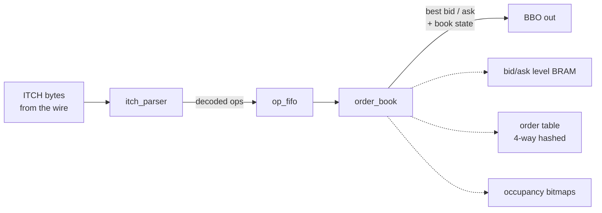

# itch_order_book

A NASDAQ ITCH 5.0 feed handler and a limit order book, built entirely in
SystemVerilog and meant to run in FPGA fabric with no CPU in the loop. It
parses the real exchange binary protocol, keeps a top-of-book that updates in
a fixed number of clock cycles, and I check every book update against a Python
reference, message for message, on genuine market data.



That's the actual book being rebuilt from a real NASDAQ TotalView-ITCH 5.0
recording (Jan 30, 2020). Every add, cancel, execute and replace moves the
ladder, and the top of book you see is bit-for-bit what the hardware emits.

## Why I built this

This is the block that sits at the front of a low latency trading system. The
exchange fires a UDP feed of order events, and you have to turn that firehose
into "what is the best bid and offer, right now" faster than anyone else. Doing
it on a CPU means cache misses and jitter. Doing it in hardware means you can
say exactly how many nanoseconds it takes, every single time, because the
answer is always the same number of cycles.

I wanted a project where the data is real, the numbers are measured and not
hand waved, and the correctness is actually proven rather than eyeballed. So
there's a golden model, a full-day co-simulation, and a couple of formal
proofs.

## How it works



**itch_parser** takes one byte per cycle off the wire, handles the length
prefix framing, and emits a decoded operation (add / execute / cancel / delete
/ replace) a couple of cycles after the last byte of each message lands. It
validates every message length against the ITCH spec table, and if a frame is
corrupt it latches an error and goes quiet instead of guessing and feeding the
book garbage.

**order_book** is the interesting part. Keeping a sorted book in hardware with
a bounded update time is a real design problem, not a toy. The trick is that I
never scan for the best price:

- Resting orders live in a **4-way set-associative hash table** keyed by the
  64-bit order reference, so a cancel or execute finds its order in a fixed
  lookup.
- Shares per price sit in **block RAM**, indexed by a penny-tick offset inside
  a price window around where the stock trades. Real books shard per symbol and
  bound their price range exactly like this.
- Each side carries a **4096-bit occupancy bitmap**. When the best level empties
  out, finding the next best price is a two-stage priority encode over the
  bitmap, not a walk through memory. That's what keeps the update time constant.

Price to tick is an exact divide-by-100 done with a reciprocal multiply (one
DSP), with off-tick and out-of-window prices detected and counted rather than
silently mangled.

**op_fifo** is a small elastic buffer between the two. The wire can't be back
pressured, but the parser can hand over an op faster than the book's worst case
service time, so a shallow FIFO absorbs the difference. On a full day of real
data its high-water mark was one entry, which is the measurement that says the
book keeps up with the feed.

There's also a `book_farm` variant that runs several per-symbol books behind a
single parser, since a real deployment tracks many symbols at once.

## Latency

The whole point is that the timing is deterministic. The book update does not
depend on how deep the book is or how many orders rest at a level.

| path | cycles |
|---|---|
| message byte in to decoded op out | 2 after the final byte |
| op accepted to book state updated | 4 |
| op accepted to best bid/offer valid | 6 |
| order replace (internally a cancel then an add) | 10 |

Six cycles, always. Turn that into nanoseconds with whatever clock you close
timing at.

## Resource usage

Synthesized with Yosys targeting a Xilinx Artix-7, single-symbol config
(8192 orders, a ~$41 price window at penny ticks). Full log in
[out/synth_xilinx.log](out/synth_xilinx.log).

| resource | count |
|---|---|
| LUTs | 29,585 |
| flip-flops | 9,421 |
| block RAM (RAMB18) | 52 |
| distributed RAM (LUTRAM) | 2,852 |
| DSP48 | 5 |

The order table lands in LUTRAM and the price-level arrays in block RAM, which
is what you'd want.

## Sizing the book

A single fixed-size book is a memory budget, and I wanted to actually measure
the tradeoff instead of guessing. I replayed the whole trading day (423 million
messages) through the reference at several table sizes and counted how often a
too-small table would drop an order and diverge from a full-depth book at the
top of book. AAPL peaks around 30k resting orders intraday, so the small
configs genuinely overflow.

| orders (config) | overflow drops | top-of-book divergence |
|---|---|---|
| 8,192  | 377,945 | 53.4% |
| 32,768 | 24,396 | 3.5% |
| 65,536 | 2,496 | 0.30% |
| 131,072 | 137 | 0.024% |

So the architecture is constant-time regardless, and this is the knob you turn
for a given symbol's depth. For a busy name you'd provision 128k orders and
carry basically no error. Numbers in
[out/capacity_study.json](out/capacity_study.json).

## How I know it's correct

This is the part I care about most, because shipping broken RTL is the thing
that actually gets you in trouble.

**A golden model.** [model/](model) is a Python ITCH 5.0 decoder and a
full-depth reference book. I checked its message layouts byte by byte against
the official Nasdaq spec, ran 5.66 million real messages through it with zero
framing errors and zero book integrity violations, and cross-checked it against
a second decoder written from scratch. The prices it reconstructs are the real
historical prices from that morning.

**Co-simulation on real data.** The cocotb benches in [tb/](tb) drive the
actual RTL with real feed bytes and compare every single BBO update against the
reference:

- parser: 10,154 real messages, all 9,664 decoded ops matched field for field
- book: every one of 4,133 top-of-book updates matched, then all 8,192 price
  levels read back and compared through a debug port
- a constrained-random torture bench that deliberately overflows a hash set
  (order refs engineered to collide), throws oversized executes, off-tick and
  out-of-window prices, duplicate refs, boundary ticks, and random wire stalls,
  and still matches the reference on every strobe and every drop counter

**A full trading day.** A Verilator harness streams the real day through the
compiled RTL and diffs the hardware's BBO stream against the model. Every one
of the 354,864 book updates it produced came out byte-for-byte identical.

**Formal proofs.** With SymbiYosys I proved the parser correct by induction, the
FIFO never overflows or corrupts data, and bounded-checked the book's
invariants. Configs in [formal/](formal).

CI runs the golden model, the cocotb benches, and the formal checks on every
push.

## Running it

You need the [OSS CAD Suite](https://github.com/YosysHQ/oss-cad-suite-build)
(Verilator, Icarus, Yosys, SymbiYosys) and a few Python packages.

```bash
pip install cocotb pytest sortedcontainers

# grab a slice of the real NASDAQ sample feed (range request, ~50 MB)
python scripts/fetch_data.py --slice-mb 48

# reference book on real data
python -m model.replay data/itch_prefix.gz --max 2000000 --watch AAPL,SPY

# RTL co-simulation against the model
python tb/run.py

# formal
cd formal && sby -f parser.sby prove && sby -f fifo.sby prove

# regenerate the demo gif
python scripts/make_demo.py data/itch_prefix.gz --symbol AAPL --out docs/demo.gif
```

## Layout

```
rtl/         itch_parser, order_book, op_fifo, book_top, book_farm
model/       python golden decoder + reference book
tb/          cocotb benches, verilator harness, expected-output generator
formal/      symbiyosys properties
synth/       yosys synthesis script
scripts/     data fetch, demo renderer
```

## Honest notes

The published Fmax depends on the target part and how hard you push
place-and-route; the deterministic story here is the cycle latency, and the
resource numbers above are from synthesis. The default config is single-symbol
and sized small on purpose so it's easy to simulate; the capacity table is how
you'd resize it for production. The data is Nasdaq's own free historical sample,
not a live feed.
